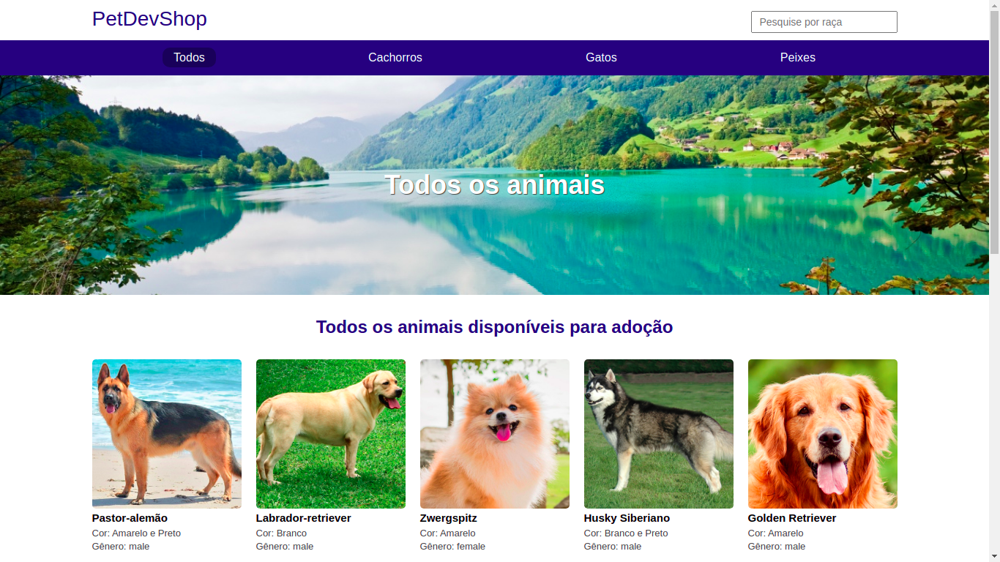

<h1 align="center">Projeto Canil</h1>



## Tecnologias
  - Node
  - TypeScript
  - Mustache

## Como executar

Clone o repositório
```bash
git clone https://github.com/alissonrsantos/ts-node-canil.git
```
Abra a pasta do projeto
```bash
cd ts-node-canil
```
Abra no Vscode
```bash
code .
```

Instale as dependências
```bash
npm install
```
ou

```bash
yarn
```
Antes de iniciar o servidor configure a porta que o mesmo irá rodar no arquivo `.env` na raiz do projeto em seguida rode o comando abaixo
```bash
yarn dev
```
ou

```bash
npm run dev
```

## &copy; Licença
MIT

Feito com ❤ por Alisson Romão Santos
